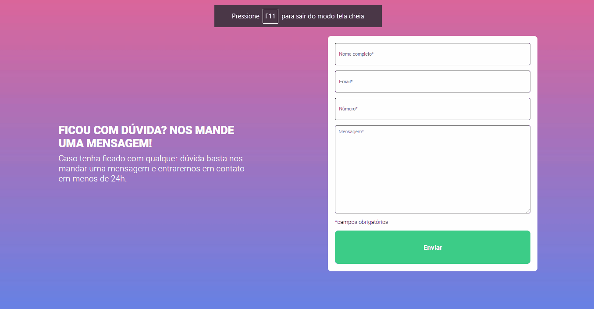

# Projeto de Validação de Formulário

Este é um projeto proposto pelo curso DevQuest, referente à validação de um formulário utilizando JavaScript.

## Tabela de Conteúdos

- [Visão Geral](#visão-geral)
    - [Imagens](#imagens)
    - [Link da página](#link)
- [Processo](#processo)
    - [Linguagens utilizadas](#linguagens-utilizadas)
    - [O que aprendi](#o-que-aprendi)
    - [Possíveis evoluções](#possíveis-evoluções)
- [Autor](#autor)

## Visão-geral

### Imagens

<br>

````
Versão de Desktop
````

   

<br>

````
Versão Mobile
````

 

### Link

- Página no GitHub Pages: <a href="https://julio-mansan2.github.io/validacao-formulario/">Clique aqui!</a>

## Processo

### Linguagens utilizadas

<br>

- Marcações semânticas de HTML5
- Propriedades de customização do CSS3
- Estruturas de JS

<br>

### O que aprendi

<br>

- Validar formulário utilizando HTML, CSS e JS:

````html

    <form class="formulario">
        <input type="text" name="nome" id="" class="input" placeholder="Nome completo*" required>
            <span class="mensagem-erro">Campo obrigatório</span>
        <input type="email" name="email" id="" class="input" placeholder="Email*" required>
            <span class="mensagem-erro">Campo obrigatório</span>
        <input type="number" name="numero" id="" class="input" placeholder="Número*" inputmode="numeric" required>
            <span class="mensagem-erro">Campo obrigatório</span>
        <textarea name="mensagem" id="input-mesage" class="input" cols="30" rows="10" placeholder="Mensagem*" required></textarea>
            <span class="mensagem-erro">Campo obrigatório</span>
        <p>*campos obrigatórios</p>
            <input type="submit" value="Enviar" id="input-submit">
    </form>

````

````css

.preenchido {
    display: none;
}

.nao-preenchido {
    display: block;
}

.valido {
    border: 1px solid #00C22B;
}

.invalido {
    border: 1px solid #F52E2E;
}

````

````javascript

const inputText = document.querySelectorAll(".input");
const inputSubmit = document.getElementById("input-submit")
const mensagemDeErro = document.querySelectorAll("span")

inputSubmit.addEventListener ('click', () => 
    inputText.forEach(function (input, indice) {
    if (input.value !== "") {            
        input.classList.add("valido")
        input.classList.remove("invalido")
        mensagemDeErro[indice].classList.remove("nao-preenchido")
    } else {
        input.classList.remove("valido")
        input.classList.add('invalido')
        mensagemDeErro[indice].classList.add("nao-preenchido")
    }

})
)

````


### Possíveis evoluções

<br>

- Utilizar medidas abrangentes para retirar as "arrows" de um input:number;
- Estilizar o required;
- Códigos mais compactos.

<br>

## Autor

GitHub - <a href="https://github.com/julio-mansan2">julio-mansan2</a> <br>